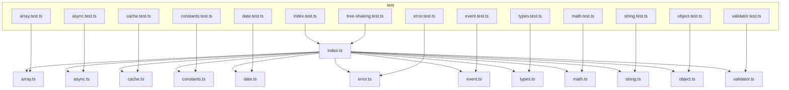

## 模块依赖图

> 使用 Mermaid 描述 monorepo 各模块依赖关系。

### 顶层包与示例应用
```mermaid
graph TD
  subgraph workspace
    subgraph packages
      U[pkg-utils]
      R[pkg-react-ui]
      V[pkg-vue-ui]
    end
    subgraph playground
      PRTS[vite-react-ts]
      PR18[vite-react18-js]
      PVTS[vue-ts]
      PVT[vanilla-ts]
    end
  end

  %% playground apps consume packages (via alias to src during dev)
  PRTS --> U
  PRTS --> R

  PR18 --> R

  PVTS --> U
  PVTS --> V

  PVT --> U

  %% external peers
  R --> REACT[react]
  R --> RDOM[react-dom]
  R --> ANTD[antd]
  R --> AS[antd-style]
  R --> ICONS[@ant-design/icons]

  V --> VUE[vue]
```

### pkg-utils 内部模块关系


### pkg-react-ui 组件库
```mermaid
graph TD
  RI[index.ts]
  DEMO[Demo.tsx]

  RI --> DEMO

  %% external deps
  DEMO --> ANTD[antd]
  DEMO --> AS[antd-style]
  DEMO --> ICONS[@ant-design/icons]
  DEMO --> REACT[react]
  DEMO --> RDOM[react-dom]
```

### pkg-vue-ui 组件库
```mermaid
graph TD
  VI[index (dist)]
  BTN[button (dist)]
  CARD[card (dist)]

  %% package.json exports map to dist entries
  VI --> BTN
  VI --> CARD

  %% external dep / peer
  VI --> VUE[vue]
  BTN --> VUE
  CARD --> VUE
```

